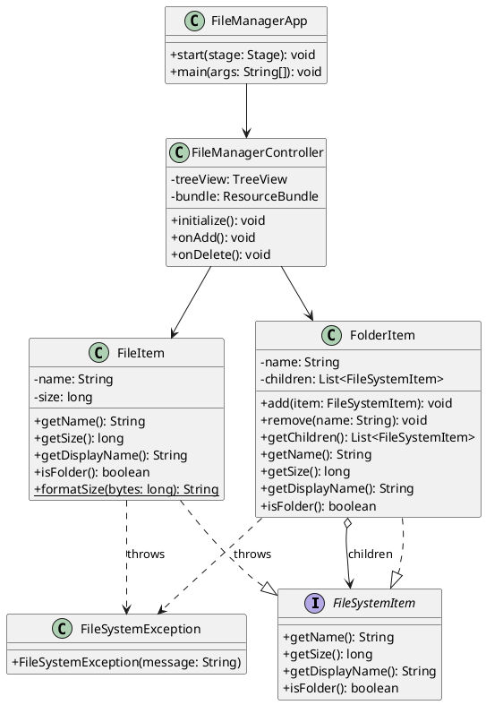
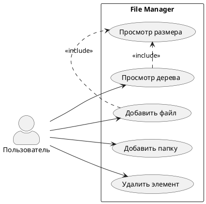
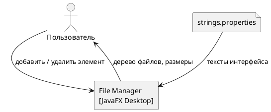
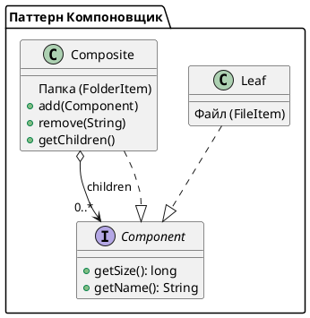

# File Manager — Composite Pattern

Лабораторная работа №2 — паттерн **Компоновщик (Composite)**.  
Десктопное JavaFX-приложение — визуальный файловый менеджер.

---

## Содержание

- [Описание](#описание)
- [Функционал](#функционал)
- [Архитектура](#архитектура)
- [Диаграммы](#диаграммы)
- [Запуск](#запуск)
- [Тесты](#тесты)

---

## Описание

Приложение визуализирует иерархическую файловую систему.  
Паттерн **Компоновщик** позволяет работать с файлами и папками через единый интерфейс `FileSystemItem` — клиентский код не различает лист и контейнер.

---

## Функционал

| Действие | Описание |
|----------|----------|
| Просмотр | Дерево файлов и папок с размерами |
| Добавление файла | Имя + размер в байтах |
| Добавление папки | Вложенные папки любой глубины |
| Удаление | Удаление выбранного элемента |
| Подсчёт размера | Папка рекурсивно суммирует размеры дочерних элементов |
| Ресурсный файл | Тексты кнопок и сообщений из `strings.properties` |

---

## Архитектура

```
src/main/java/org/example/filemanager/
├── component/
│   └── FileSystemItem.java      # Интерфейс — компонент паттерна
├── leaf/
│   └── FileItem.java            # Лист — простой файл
├── composite/
│   └── FolderItem.java          # Контейнер — папка с дочерними элементами
├── exception/
│   └── FileSystemException.java # Исключения файловой системы
├── controller/
│   └── FileManagerController.java
└── FileManagerApp.java          # Точка входа JavaFX
```

---

## Диаграммы

### Диаграмма классов (Composite)



---

### Use Case



---

### Контекстная диаграмма



---

### Структура паттерна Компоновщик



---

## Запуск

### Через Maven

```bash
mvn javafx:run
```

### Run Configuration в IntelliJ IDEA

Main class:
```
org.example.filemanager.FileManagerApp
```

---

## Тесты

```bash
mvn test
```

Тест-класс `FileSystemTest` покрывает:

| Группа | Тесты |
|--------|-------|
| `getSize()` | файл, пустая папка, сумма, рекурсия |
| Исключения `FileItem` | пустое имя, null имя, отрицательный размер |
| Исключения `FolderItem` | пустое имя, добавление null, дубликат, удаление несуществующего |
| `isFolder()` | файл → false, папка → true |

---

## Критерии оценки

- [x] Индивидуальный дизайн (вариант 4 — файловый менеджер)
- [x] Обработка исключений в `FolderItem` и `FileItem`
- [x] Использование ресурсного файла `strings.properties`
- [x] Unit-тесты (JUnit 5)
- [x] Паттерн Компоновщик: единый интерфейс для файла и папки
